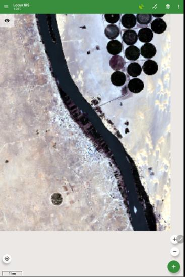
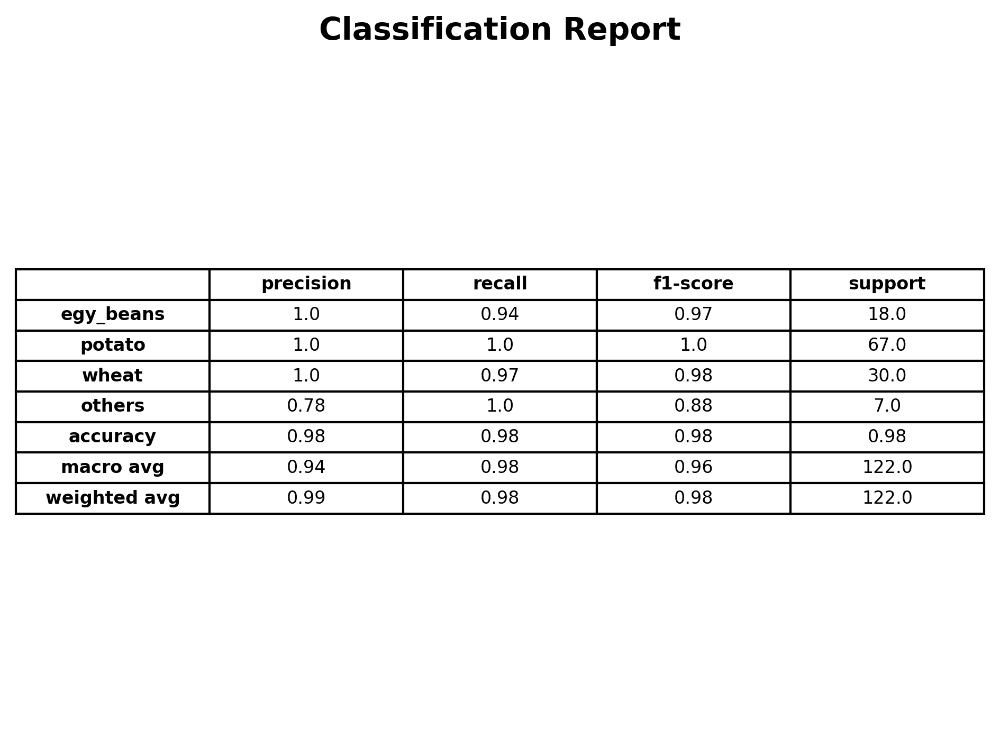
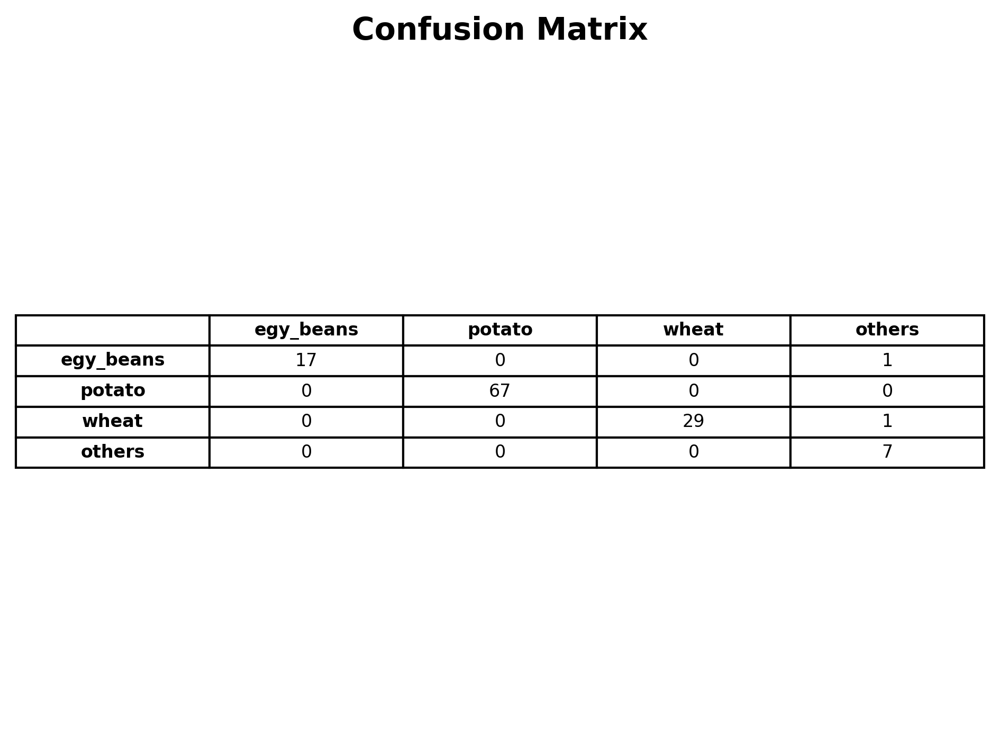
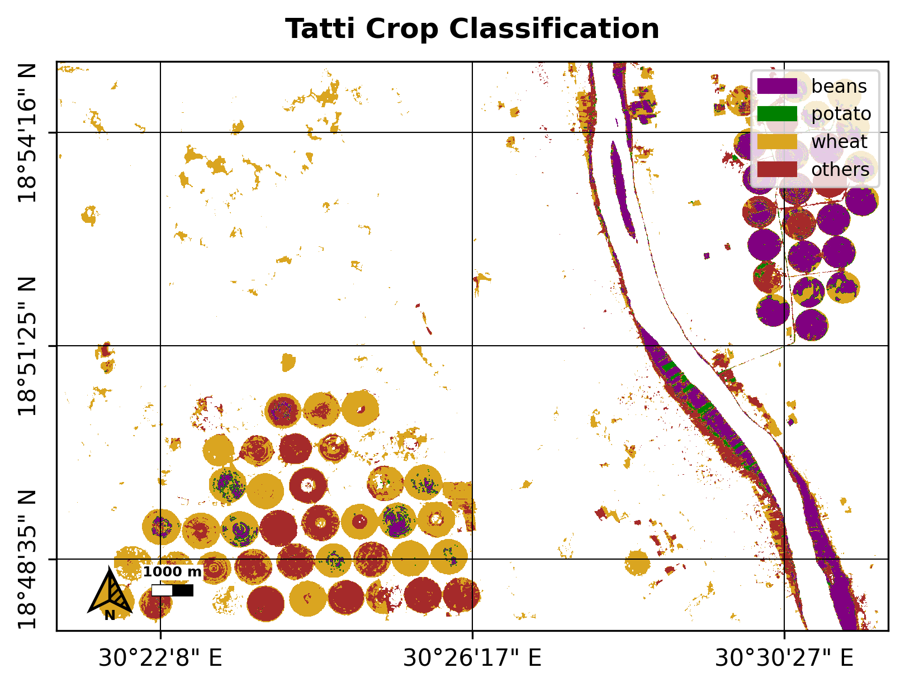

# Machine Learning Crop classification using optical remote sensing

Following [NASA ARSET - Agricultural Crop Classification](https://appliedsciences.nasa.gov/get-involved/training/english/arset-agricultural-crop-classification-synthetic-aperture-radar-and) training.

* Satellite: sentinel-2.
* Machine learning model: Random Forest Classifier.
* Machine learning Package: scikit-learn.
# How to use
### Proposed method for data collection:
* Prepare a map with preprocessed data to help the collectors in identifying the suitable areas for dropping the crops’ locations.
* Export the map, then use it in a data collection gis application (e.g. locus GIS).\


### Folders layout
```bash
┌─── project_folder ───┐
│   ├── area
│   │   ├── aoi.geojson
│   │   ├── ag_only.geojson
│   │   └── study_area.geojson
│   ├── data
│   │   ├── points
│   │   │   ├── train_pts.geojson
│   │   │   └── val_pts.geojson
│   │   └── s2
│   │   │   ├── s2_2023-10-01.tif
│   │   │   │
│   │   │   ...
│   │   │   └── s2_2024-03-31.tif
│   ├── results
│   │
│   ├── funcs
│  ...
│   └── README.md
└─────────────────────┘
```
- aoi.geojson = area of interest
- ag_only.geojson = mask out none agricultural area (optional)
- study_area.geojson = to download the images from GEE
- train_pts.geojson = training points (Attributes must include | type (number represent crop type) | xcoord (x coordination) | ycoord(y coordination) |)
- val_pts.geojson = validation points (Attributes must include | type (number represent crop type) | xcoord (x coordination) | ycoord(y coordination) |)
- s2 = folder containing sentinel 2 images
- results = automatically filled with results
- funcs = functions

## Script steps
### 0. Download the images
* Images downloaded from google earth engine (GEE) through google drive.
* Using GEE sentinel images are averaged in weekly images.
* Images can be downloaded directly from the satellite image provider.
### 1. Co-register and stack the images in one tif
Images are directly stacked. The co-registering function will be writing in upcoming versions.
### 2. Train the model
* Visualize and inspect the data.
* Split the data into training and validation (stratified split).
    - 70 % train data.
	- 30 % test data.
### 3. test the model
* Test the model in a different area.
* Visualize and save testing results.
### 4. Use the model
* Use the model to reproduce a classified image.
### 5. Visualize the results.
* Visualize the image in a map formate (made entirely using matplotlib).

# Example for a village in Northern State, Sudan.
### Model Properties


### produced maps
.png)


### Full example
You can see the full example (all the notebooks filled) in [my google drive](https://drive.google.com/drive/folders/1WmC6cmbxRTBU-ZaSBDiasty0-ewUUqPo?usp=sharing).

### contact
email: mohammedalmak98@gmail.com\
LinkedIn: [Mohammed Salah](https://www.linkedin.com/in/mohammed-salah-16aa75237/)